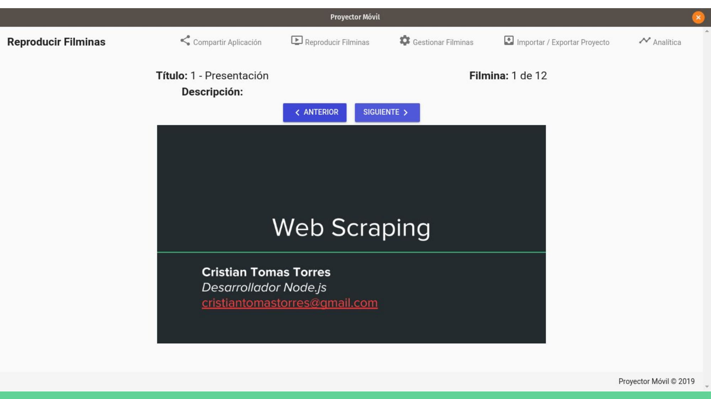

# :film_projector: Proyector Móvil  

## ¿Qué es Proyector Móvil?

Proyector Móvil es una aplicación web y de escritorio que permite emitir y mostrar imágenes (filminas) a dispositivos remotos conectados a una misma red local.

# Descargas

- [Windows 32 / 64 bits](https://sourceforge.net/projects/proyector-movil/files/proyector-movil-windows.zip/download)
- [Linux](https://sourceforge.net/projects/proyector-movil/files/proyector-movil-linux.zip/download)

# Página en construcción

más detalles en:

- [Manual de Usuario](https://drive.google.com/open?id=1ROd6UMAViuXlJJnbGe3NdxwWQIWVeVk7)